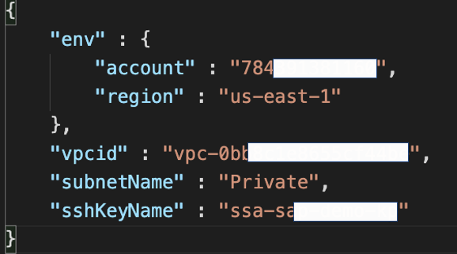

# SAP Netweaver 7.5 on Oracle Database installation using AWS CDK

This is an example of how to use **AWS Cloud Development Kit (AWS CDK)** to automatically deploys an SAP NetWeaver 7.5 for ABAP on the AWS using Oracle Database 19. The operating system is based on Oracle Linux 8.

This deploys an SAP standard installation only within a virtual private cloud (VPC) in your AWS account. 

## SAP Standard Installation Stack

### Create a Amazon S3 bucket for SAP binaries
In the Amazon S3 bucket created, create the following S3 prefix structure to organize your SAP downloads. This step is manual and often the most difficult part of the SAP installation, as you will need to have the correct binaires downloaded from SAP Service Marketplace using your SAP user ID and password. Your S3 folders should be named exactly as shown. Getting the folder and binaires right is the most important part of the automation.

SAP binaries are provided in ZIP or SAR format. This needs to be unzip before uploading to the Amazon S3 bucket (with the exception of SWPM). Within each folders are unzipped binaries.  

The extracted binaries in EXP_CD is shown below.

Please note that if you downloaded the default Kernel CD, then you will need to provide the latest kernel for this to work. By default, the kernel 7.49 is provided by SAP, but please ensure the SAPEXE.SAR, SAPEXEDB.SAR and DBATOOLS.SAR are updated to the latest version or the installation will fail. As the time of writing this README, the latest kernel is 7.53. 

For SWPM, do not extract the binaries. This has to be extracted as part of the installation process because SAP checks for the integrity of the file.

### Update appConfig.json
Update the appCongig.json in the lib folder. The information required here is the AWS account ID, region, VPC, Subnet and the SSH Key to login to the server. An example is shown below.

### Update bootstrap.sh 
This is where you need to put in the S3 folder created in step 1 with all the binaries. In addition, you can customise the deployment such as the Oracle SID and hostname of the server. By default, this is set to OR1. If this is your first automated deployment, please use the default SID of DEV for SAP, and OR1 for Oracle. Once this is successful, then you can customise it further. 

This deployment is based on the unattended mode of the SAP Software Provisioning Manager. This means that, after inserting the required parameters into a parameter-file and providing the file to SAPinst executable. Please refer to [SAP Note 2230669](https://launchpad.support.sap.com/#/notes/2230669) for further information. 

### Update inifile.params (Optional)
By default, the SAP SID is set to DEV and the password is nimda1234 and the ORA SID is OR1. You can search for these in the inifile and customise it based on your need. 

### Start the deployment
If these are set up correctly, you should be able to deploy the complete SAP system by simply running the cdk deploy command. 

Work Hard, Have fun, Make History! 
